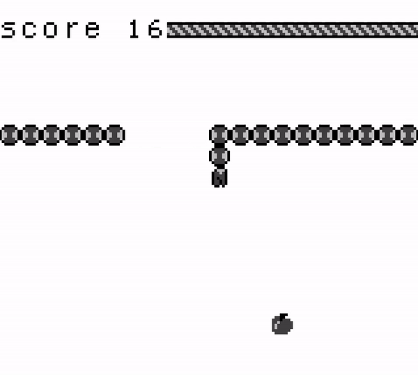

<div align="center">


A compiler for the object-oriented programming language Deca (mostly a Java subset).



</div>

## 🎓 School Project Information

|  |  |
|--|--|
| Team   | 5 |
| Course | Software Engineering Project |
| School | Grenoble INP - Ensimag |

## 🚀 Project Development Overview

### Core Compiler

The project was divided into 4 main parts, each representing a Deca functionality.

1. Hello-World – Display a String.
2. No-Object – Variables, Arithmetics, Conditional Statements...
3. Objects – Classes (Attributes & Methods).
4. Complete – Casts & InstanceOf.

Subsequently, each of these parts was further broken down into 3 subparts, which were then assigned to specific team members. This allowed us to efficiently work in parallel.

- Lexing & Parsing (Antlr4).
- Contextual Analysis.
- Assembly Code Generation.

Personally, I was responsible for the **Assembly Code Generation** part in its entirety.

Testing our compiler played a crucial role in our project. We created specific tests for each subpart, along with automated test scripts. Additionally, we used [Jacoco](https://www.jacoco.org/jacoco/) as our **Code Coverage** tool, reaching a satisfying 96% coverage with our tests.

### GameBoy Compiler

The most interesting part of the project was the opportunity to extend our compiler's functionalities. We decided to tackle the challenge of making Deca compatible with the original [Nintendo GameBoy](https://en.wikipedia.org/wiki/Game_Boy) (1989).

Once again, I handled the **GameBoy Assembly Code Generation** ([GBZ80](https://rgbds.gbdev.io/docs/v0.7.0/gbz80.7)). This task proved to be really challenging due to the very old architecture of the GameBoy.

Meanwhile, my team was developing a **Deca GameBoy Library** to simplify the management of graphics and inputs.

Ultimately, we successfully created a fully functional game of Snake for the GameBoy in Deca, using our compiler and library.

<div align="center">


</div>

## 🖥️ Deca Programming Language

The Deca language is quite similar to Java. For a typical example of a Deca program, refer to [```binaryTree.deca```](src/test/deca/codegen/valid/programs/binaryTree.deca). You can find additional examples in [```src/test/deca/codegen/valid/```](src/test/deca/codegen/valid/).

### GameBoy

For GameBoy development, you can refer to our Snake game example. Check out [```Snake.decah```](src/test/deca/gameboy_lib/Snake.decah) and [```SnakeGame.deca```](src/test/deca/gameboy_lib/SnakeGame.deca) for the relevant code.

## 📦 Compile Deca Code

The syntax for using the `decac` compiler is as below.

```
decac [[-p | -v] [-n] [-r X] [-d]* [-P] myFile.deca] 
```

The `decac` command, when run without arguments, will display the available options. You can also call `decac` with one or more Deca source files.

- `-p` (Parse) &ndash; Stops `decac` after building the abstract syntax tree and shows a decompilation of the tree. If there is only one source file, the output is a syntactically correct Deca program.
- `-v` (Verification) &ndash; Stops `decac` after performing semantic checks. No output is produced if there are no errors.
- `-n` (No-Check) &ndash; Disables certain runtime error checks.
- `-r X` (Registers) &ndash; Limits the number of registers used to X, where 4 <= X <= 16.
- `-d` (Debug) &ndash; Enables debug traces. This option can be repeated up to 3 times for more detailed traces.
- `-P` (Parallel) &ndash; If multiple source files are provided, this option compiles them in parallel using one thread per file, speeding up compilation.

### GameBoy Compilation

#### Required

- [RGBDS](https://rgbds.gbdev.io/install) &ndash; This is required to assemble the code generated by `decac` into GameBoy executable format.
- [Emulicious](https://emulicious.net/downloads/) &ndash; Recommended GameBoy emulator for running and testing your compiled games.

#### Compilation

- Use `decac` with the `-g` flag to generate a `.asm` file from your Deca program.

```
decac -g myGame.deca
```

- Compile the `.asm` file w/ RGBDS.

```
rgbasm -L -o myGame.o myGame.asm
rgblink -o myGame.gb myGame.o
rgbfix -v -p 0xFF myGame.gb
```

- Run the resulting `myGame.gb` w/ Emulicious.

#### Simplified Workflow

- To simplify this process, `decac` provides the `-gb` flag, which directly generates the final `.gb` file.

```
decac -gb myGame.deca
```

> [!IMPORTANT]
> This requires RGBDS in your `PATH`.

## 🛠️ How To Build

- Build w/ Maven.

```
mvn package
```

- The `decac` compiler will be in `./target/package/decac`.

---

<div align="center">
  Copyright &#169; 2024 PyroWilDx. All Rights Reserved.
</div>
