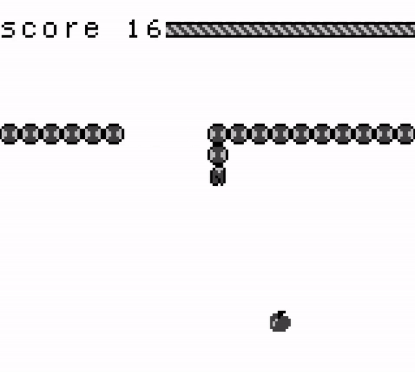

# Deca-Compiler

[**Deca-Compiler**](https://github.com/PyroWilDx/Deca-Compiler/) is a compiler for the the object-oriented programming language Deca (mostly a Java subset).

This project was made in a **Team of 5** as part of the **Software Engineering Project** course at [Grenoble INP &ndash; Ensimag](https://ensimag.grenoble-inp.fr/).

## Project Development Overview

### Core

To successfully implement our compiler, we used [Agile Software Development](https://en.wikipedia.org/wiki/Agile_software_development). Therefore, we divided the project into 4 main parts, each representing a Deca functionality.

1. Hello-World – Display a String.
2. No-Object – Variables, Arithmetics, Conditional Statements...
3. Objects – Classes (Attributes & Methods).
4. Complete – Casts & InstanceOf.

Subsequently, each of these parts was further broken down into 3 subparts, which were then assigned to specific team members. This allowed us to efficiently work in parallel.

- Lexing & Parsing (Antlr4).
- Contextual Analysis.
- Assembly Code Generation.

Personally, I was responsible for the **Assembly Code Generation** part in its entirety.

Testing our compiler played a crucial role in our project. We created specific tests for each subpart, along with automated test scripts. Additionally, we used Jacoco as our **Code Coverage** tool, reaching a satisfying 96% coverage with our tests.

### GameBoy

The most interesting part of the project was the opportunity to extend our compiler's functionalities. We decided to tackle the challenge of making Deca compatible with the original [Nintendo GameBoy](https://en.wikipedia.org/wiki/Game_Boy) (1989).

Once again, I handled the **GameBoy Assembly Code Generation** ([GBZ80](https://rgbds.gbdev.io/docs/v0.7.0/gbz80.7)). This task proved to be really challenging due to the very old architecture of the GameBoy.

Meanwhile, my team was developing a **Deca GameBoy Library** to simplify the management of graphics and inputs.

Ultimately, we successfully created a fully functional game of Snake for the GameBoy in Deca, using our compiler and library.



## Deca Programming Language

The Deca language is quite similar to Java. For a typical example of a Deca program, refer to [```binaryTree.deca```](src/test/deca/codegen/valid/programs/binaryTree.deca). You can find additional examples in [```src/test/deca/codegen/valid/```](src/test/deca/codegen/valid/).

For GameBoy development, you can refer to our Snake game example. Check out [```Snake.decah```](src/test/deca/gameboy_lib/Snake.decah) and [```SnakeGame.deca```](src/test/deca/gameboy_lib/SnakeGame.deca) for the relevant code.

To compile a Deca program, consult our [User Manual](docs/Manuel-Utilisateur.pdf).

For more details on the technical implementations, check out the docs.
- [Core Docs](docs/Conception.pdf)
- [GameBoy Docs](docs/Extension.pdf)

## Development Set-Up

<div align="center">

| [](https://www.java.com/) | [](https://maven.apache.org/) | [](https://www.jetbrains.com/idea/) | [](https://www.linux.org/) |
|---|---|---|---|

</div>

### How To Use

- Run w/ Maven.

---

<div align="center">
  Copyright &#169; 2024 PyroWilDx. All Rights Reserved.
</div>
